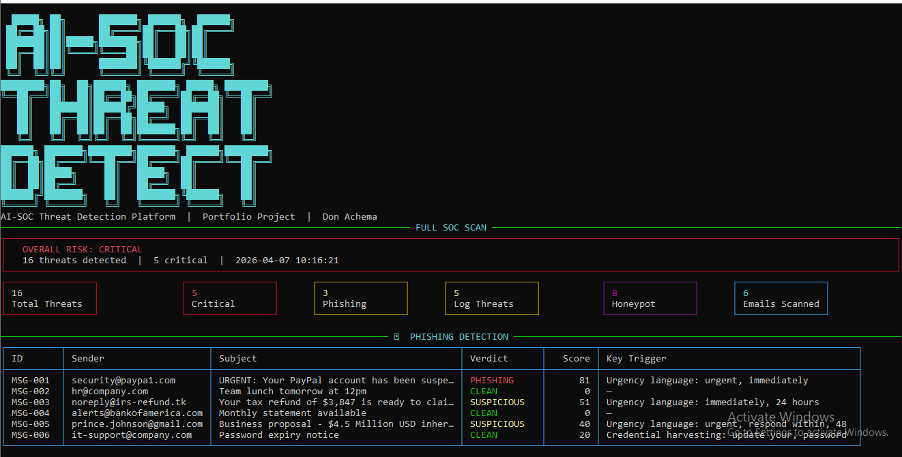
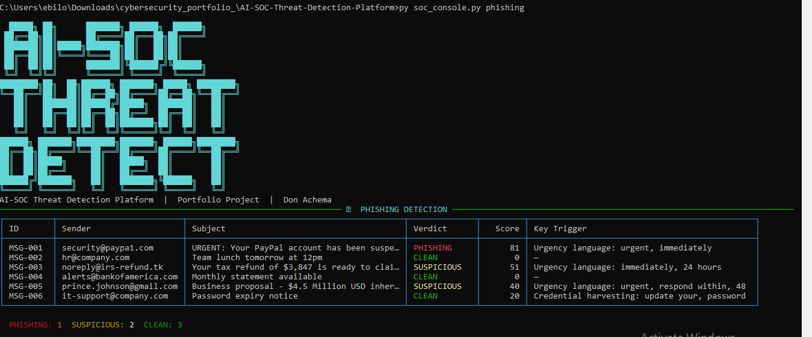
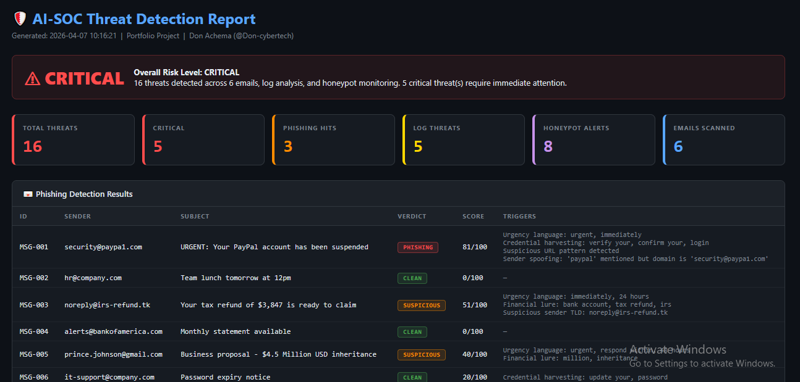

<h1 align="center">
  🛡️ AI-SOC Threat Detection Platform
</h1>

<p align="center">
  <b>AI-powered Security Operations Centre — phishing detection, log analysis, and honeypot monitoring.</b>
</p>

<p align="center">
  
  
  
  
  
</p>

---

## 📸 Screenshots

### 1. Full SOC Scan (CLI)


### 2. Phishing Detection Results


### 3. HTML Threat Report


---

## 🧠 What It Does

| Module | Description |
|---|---|
| **📧 Phishing Detector** | Scores emails using TF-IDF keyword analysis, URL inspection, and sender spoofing detection |
| **📋 Log Analyzer** | Detects brute force, credential stuffing, off-hours logins, and privilege escalation from log files |
| **🍯 Honeypot Monitor** | Tracks connection attempts on SSH, RDP, SMB, FTP, Telnet, and HTTP traps |
| **📊 HTML Report** | Generates a professional dark-themed threat report with all findings |

---

## 🏗️ Architecture

```
AI-SOC-Threat-Detection-Platform/
├── soc_console.py         ← Main CLI entry point (Rich interface)
├── phishing_detector.py   ← AI email phishing detection
├── log_analyzer.py        ← Brute force & anomaly log analysis
├── honeypot_monitor.py    ← Honeypot alert simulation
├── threat_engine.py       ← Unified threat scoring + HTML report
└── requirements.txt
```

### Phishing Detection Scoring

| Signal | Max Points |
|---|---|
| Urgency keywords (act now, expires, suspended) | 25 |
| Financial lures (prize, lottery, inheritance) | 20 |
| Credential harvesting (verify, login, confirm) | 25 |
| Suspicious URLs (bit.ly, IP-based, free TLDs) | 30 |
| Sender domain spoofing | 20 |

**Verdicts:** PHISHING (60+) | SUSPICIOUS (35–59) | CLEAN (0–34)

### Log Analysis — Threat Detection

| Threat | Trigger |
|---|---|
| Brute Force | 5+ failed logins from same IP |
| Credential Stuffing | 4+ different usernames from same IP |
| Off-Hours Login | Successful login outside 08:00–18:00 |
| Privilege Escalation | Failed sudo/su attempts |

---

## ⚙️ Setup

```cmd
cd AI-SOC-Threat-Detection-Platform
pip install -r requirements.txt
```

---

## 🚀 Usage

### Full scan with HTML report
```cmd
python soc_console.py scan
```

### Scan with custom output path
```cmd
python soc_console.py scan --output my_report.html
```

### Scan with a real log file
```cmd
python soc_console.py scan --log C:\path\to\auth.log
```

### Phishing detection only
```cmd
python soc_console.py phishing
```

### Log analysis only
```cmd
python soc_console.py logs
```

### Honeypot monitor only
```cmd
python soc_console.py honeypot
```

---

## 🔐 Security Design

- **No external ML libraries** — phishing detection works fully offline
- **k-anonymous threat scoring** — no data sent externally
- **Real log file support** — parse actual syslog/auth.log files
- **Demo mode by default** — safe to run and demonstrate anywhere

---

## 🛠️ Skills Demonstrated

- **NLP / TF-IDF** keyword scoring for email classification
- **Regex-based log parsing** for threat extraction
- **Anomaly detection** (off-hours logins, brute force patterns)
- **Honeypot architecture** (multi-service trap simulation)
- **HTML report generation** (professional dark-themed output)
- **Rich CLI** with panels, tables, stat cards
- **Modular architecture** (5 independent, testable modules)

---

## 👨‍💻 Author

**Don Achema** — [@Don-cybertech](https://github.com/Don-cybertech)  
Cybersecurity Student | Python Security Tools Portfolio
